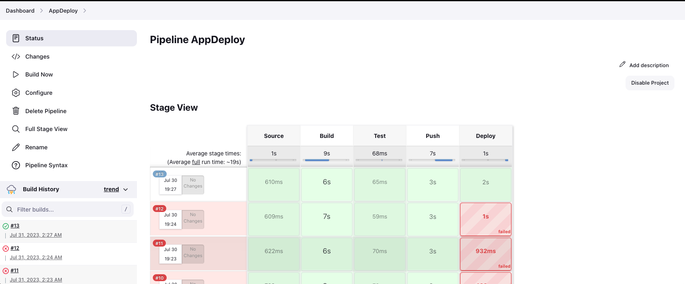

# wecloudTask8
# Jenkins Server Setup on AWS

This guide will help you set up a Jenkins server on AWS using an EC2 instance with Ubuntu.

### Prerequisites
- AWS account
- Basic knowledge of AWS services

### Steps

1. **Create EC2 with Ubuntu**

   Launch an EC2 instance with Ubuntu on AWS.

2. **SSH into the EC2 instance**

   Once the EC2 instance is running, SSH into it using the key pair associated with the instance.

3. **Update package list and install Jenkins**

   Run the following commands in the terminal:
   ```
   sudo apt-get update
   wget -q -O - https://pkg.jenkins.io/debian-stable/jenkins.io.key | sudo apt-key add -
   sudo sh -c 'echo deb https://pkg.jenkins.io/debian-stable binary/ > /etc/apt/sources.list.d/jenkins.list'
   sudo apt-get update
   sudo apt-get install jenkins
   sudo apt-get install openjdk-11-jdk
   systemctl restart jenkins.service
   ```

4. **Spin up Amazon EKS Cluster**

   To deploy your app into an AWS EKS cluster, follow these steps:

   1. **Create VPC using CloudFormation**

      Use the CloudFormation template provided at the following S3 URL to create the VPC:
      `https://s3.us-west-2.amazonaws.com/amazon-eks/cloudformation/2020-10-29/amazon-eks-vpc-private-subnets.yaml`

   2. **Create IAM User for EKS**

      Create an IAM user with appropriate permissions for EKS.

   3. **Launch EKS Cluster using AWS Management Console**

      Use the AWS Management Console to create a new EKS cluster, selecting the VPC you created earlier.

   4. **Create IAM Role for EKS Nodes**

      Create an IAM role with necessary permissions for the EKS nodes.

   5. **Add a New Node Group for EKS**

      Add a new node group to the EKS cluster to scale your worker nodes.

5. **Deploy the App to AWS EKS Cluster**

   To deploy your app, follow these steps:

   1. **Install kubectl locally**

      Install kubectl on your local machine to interact with the EKS cluster.

   2. **Update Kubernetes Config**

      Change your `~/.kube/config` by running the following command:
      ```
      aws eks --region us-west-1 update-kubeconfig --name EKS_NAME
      ```
      Replace `EKS_NAME` with the name of your EKS cluster.

   3. **Apply Deployment YAML**

      Apply the deployment YAML (`deploy.yaml`) to deploy your app to the EKS cluster using the following command:
      ```
      kubectl apply -f deploy.yaml
      ```

6. **Access App from the Public Internet**

   After the app is launched into the AWS EKS cluster, a LoadBalancer service will be created. To access the app from the public internet, follow these steps:

   1. Navigate to the AWS Management Console and find the LoadBalancer associated with your app.

   2. Copy the DNS name of the LoadBalancer.

   3. Paste the DNS name in your browser to access the app.

### Jenkins Pipeline

The Jenkins pipeline for this project can be found in the `SelfProject/jenkinsfile` file.

### Pipeline Overview

[](pipeline.png)

Feel free to reach out if you have any questions or need further assistance! Happy coding!
